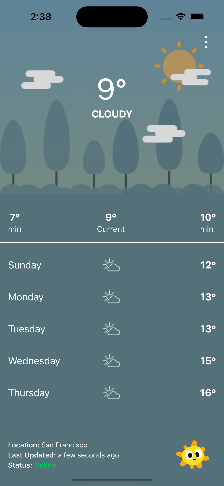
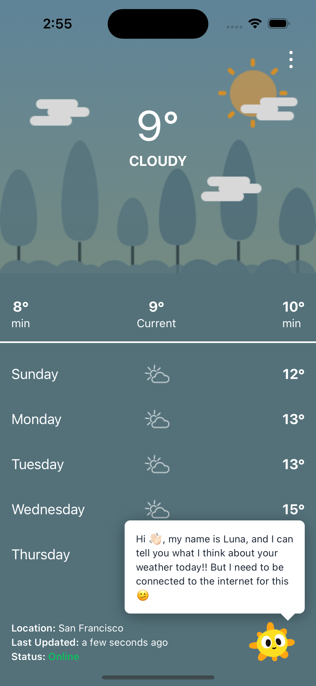
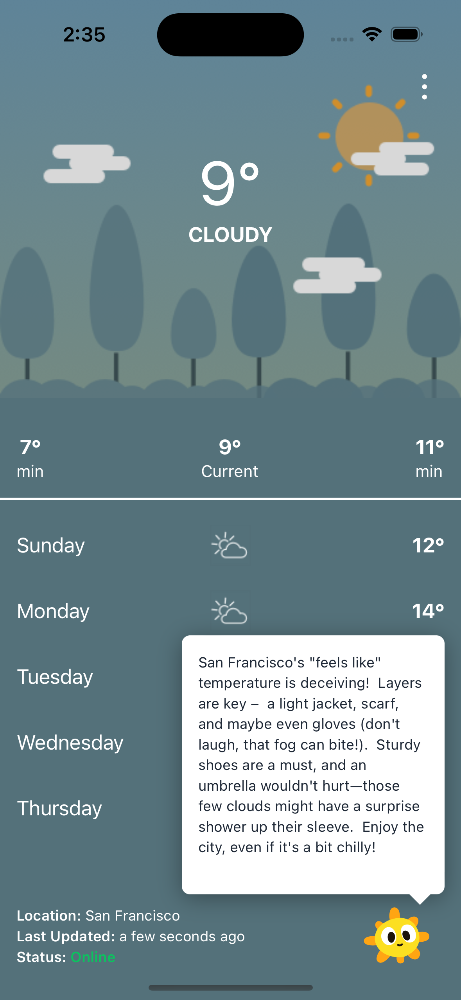

# AnyWeather ☀️ 🌦️ ❄️


## Table of Contents  
1. [App Branding](#app-branding-and-ui) 
2. [Demo Android APK](#demo-android-apk) 
3. [Conventions](#conventions)  
4. [Architecture and General Considerations](#architecture-and-general-considerations)  
5. [CI CD](#ci-cd)
6. [Special Feature](#special-feature) 
7. [Third-Party Libraries](#third-party-libraries)  
8. [Building the Project](#building-the-project)  
9. [Additional Notes](#additional-notes)  

---

## App Branding and UI


| Home | Menu | Favorites | Location access | About |
|-|-|-|-|-|
|  |  |  |  |  |
---

## Demo Android APK
I have included a demo of the application on [this link here](https://drive.google.com/file/d/1_wl9HRypn7Y61CT5-_63ev4df9bT55kA/view?usp=drive_link). Feel free to download it and run it on any android phone.

## Conventions  
- **Language**: TypeScript for static typing with type safety and improved developer experience and formatted using Prettier. 
    ```  

---

## Architecture and General Considerations  

### Architecture  
- **State Management**: Managed using **React Query** for asynchronous data fetching and caching.  
- **UI Framework**: Built with **React Native (expo)**, styled using **Tailwind CSS** for rapid development.  
- **Backend Integration**: Weather data fetched from [OpenWeatherMap API](https://openweathermap.org/) and location services integrated via [GeoDB Cities API](https://rapidapi.com/wirefreethought/api/geodb-cities).  

### General Considerations  
1. **Expo EAS**: Expo simplifies React Native development with pre-configured tools, seamless workflows, and cloud services for building, testing, and deploying cross-platform apps efficiently.  
1. **Offline Mode**: Caching with React Query ensures weather data remains accessible even offline.  
2. **Responsiveness**: Flexible layout with Tailwind ensures a seamless experience across devices. 

---
## CI CD

This project was generated from expo using [expo.new](https://expo.new) which does set up a basic form of CI/CD (Continuous Integration and Continuous Deployment).

#### Expo EAS benefits:
- Automatically builds the app whenever updates are made to github
Depending on the github branch, a different build is made. For example, an update to the develop branch will trigger development builds while updating the main branch will generate a production build.
Below is a screenshot showing an ongoing build for this app happening on Github.

- Expo EAS also comes with the advantage of **OTA Builds**. Over-the-air (OTA) builds enable instant updates to your app without requiring users to download a new version from the app store.

### Default Setup
The consideration made to create the new project via [expo.new](https://expo.new) was to have it align with **Expo's Development Workflow** which gives us a project structure that is compatible with Expo Application Services (EAS).

This project uses EAS services (like EAS Build or EAS Submit), and has the tools for automating builds, testing, and deploying to app stores.

### EAS Build and Submit:

EAS Build is designed to work like a CI tool for building apps in the cloud and the builds for this app are triggered automatically when pushing changes to the main branches, simulating CI/CD behavior.

---

## Special Feature (AI)
I have integrated AI into the weather app by leveraging Google Gemini's generative capabilities. This implementation provides users with personalized suggestions on what to wear, carry, or consider based on the current weather conditions. By analyzing data such as temperature, weather type, and user location, the app delivers concise, practical advice with a touch of humor, enhancing the overall user experience and making weather insights more actionable and engaging.

### Screenshots

| Online | Bot Offline | Bot Response |
|-|-|-|
|  |  |  |

---

## Third-Party Libraries  

| Library                | Purpose                                                                 |
|-------------------------|-------------------------------------------------------------------------|
| **React Native**        | Core framework for building cross-platform mobile apps.               |
| **React Query**         | Handles API calls, caching, and data synchronization.                 |
| **Axios**               | Simplifies HTTP requests with a clean syntax.                         |
| **React Navigation**    | Provides navigation and routing for the app.                         |
| **Tailwind CSS**        | Utility-first CSS framework for responsive designs.                   |
| **GeoDB Cities API**    | Retrieves city information for search functionality.                  |
| **OpenWeatherMap API**  | Fetches weather data and 5-day forecasts.                             |
| **Prettier**            | Code formatting to ensure consistent style.                          |
| **ESLint**              | Static analysis to catch errors and enforce code quality.             |

---

## Building the Project  

### Prerequisites  
1. **Node.js** (v16 or later)  
2. **Expo CLI** installed globally:  
   ```bash
   npm install -g expo-cli


### Steps to Build  
1. Clone the repository:
```bash
   git clone https://github.com/StephenAraka/weather-app-2.git
   cd weather-app-2
```

2. Install dependencies:
   ```bash
   npm install
   ```

3. Add your API keys to .env file:
   ```bash
   OPENWEATHER_API_KEY=your_openweather_key
   GEODB_API_KEY=your_geodb_key
   ```

4. Start the project:
   ```bash
   expo start
   ```
5. Test the app on a simulator or a physical device by scanning the QR code.


## Additional Notes
#### 1. Optimizations:

- **Debouncing**: Search input is debounced to reduce API calls while typing.

#### 2. Testing:
   - Manual testing for all screens and workflows.
   - Future plans to integrate Jest for unit tests and Detox for end-to-end tests.

#### 3. Future Enhancements:

- **Dark Mode**: Toggle theme based on user preferences, I had also considered using dark mode for locations where the time is already night time.
- **Weather Alerts**: Notify users of severe weather conditions.
- **Multi-Language Support**: Expand the app’s usability for global users.
- **Error Handling**: Graceful error messages for network issues or invalid inputs.
- **Accessibility**: Adhering to WCAG guidelines for text contrast and touch targets.
- **Scalability**: Modular architecture allows easy addition of new features.
- **More CI/CD**: Integrating project with CI/CD tools such as GitHub Actions in addition to EAS build.

#### 4. Challenges & Learnings:

- Integrating two separate APIs (GeoDB and OpenWeatherMap) taught me how to handle complex API workflows.
- Learned how to optimize performance using React Query for caching and synchronization.

